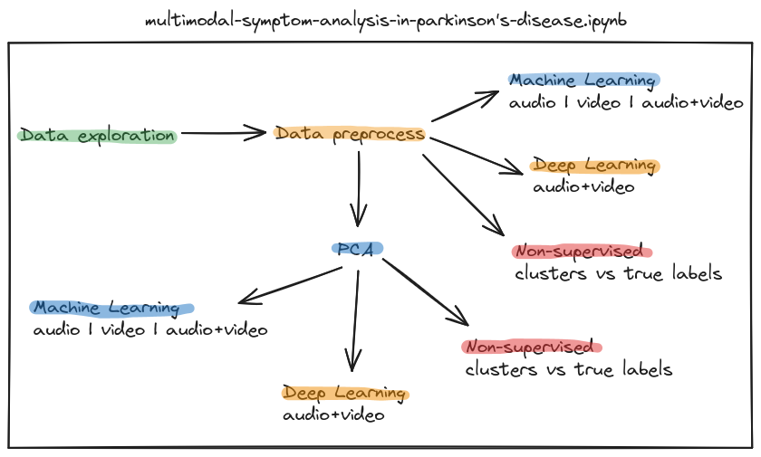

# Multimodal Early Detection of Parkinson's Disease

| **Model**                        | **Accuracy (%)**         | **F1-score (%)**         | **Precision (%)**        | **Sensitivity (%)**      |
|----------------------------------|----------------------|----------------------|----------------------|----------------------|
| **GNB**                          | 47.57% (+/- 28.63%)  | 43.10% (+/- 35.11%)  | 45.53% (+/- 38.91%)  | 50.00% (+/- 44.27%)  |
| **DT DEFAULT**                   | 47.91% (+/- 17.37%)  |  51.32%  (+/- 21.78%) | 47.08% (+/- 21.57%)  |  58.61%  (+/- 25.81%) |
| **DT2**                          | 45.60% (+/- 20.45%)  | 44.49% (+/- 26.51%)  | 43.02% (+/- 23.51%)  | 51.28% (+/- 35.02%)  |
| **DT40**                         | 45.54% (+/- 19.07%)  | 35.64% (+/- 26.47%)  | 41.21% (+/- 26.77%)  | 35.90% (+/- 30.77%)  |
| **RF50**                         | 47.48% (+/- 14.60%)  | 34.11% (+/- 25.91%)  | 48.09% (+/- 31.68%)  | 38.64% (+/- 39.58%)  |
| **RF100**                        | 47.30% (+/- 18.17%)  | 37.66% (+/- 29.20%)  | 40.64% (+/- 31.06%)  | 43.04% (+/- 39.83%)  |
| **RF200**                        | 47.85% (+/- 18.61%)  | 40.05% (+/- 27.48%)  | 46.19% (+/- 35.03%)  | 44.14% (+/- 38.27%)  |
| **SVM LINEAR**                   | 74.62%  (+/- 17.44%) |  63.93%  (+/- 33.15%) |  **78.13%  (+/- 35.28%)** |  61.88%  (+/- 36.44%) |
| **SVM RBF**                      | **77.79%  (+/- 22.63%)** |  **68.31%  (+/- 38.01%)** |  76.81%  (+/- 35.54%) |  **71.98%  (+/- 41.72%)** |
| **SVM POLY DEGREE 3**            | 48.27% (+/- 13.64%)  | 11.16% (+/- 13.06%)  | 43.36% (+/- 49.07%)  | 6.60% (+/- 7.61%)    |
| **LR**                           | 74.15% (+/- 16.27%)  | 64.31% (+/- 30.82%)  | 77.72% (+/- 35.14%)  | 60.92% (+/- 33.81%)  |

## Overview

This repository contains the work done as part of the Artificial Intelligence I project for the Universidad Industrial de Santander. This project aims to develop a non-invasive multimodal strategy to enhance early detection of Parkinson's disease. By utilizing video and audio analysis techniques, we seek to identify distinctive patterns in motor symptoms such as facial rigidity and speech disorders.

**Team Members**: Juan Diego Roa Porras, Andrés Felipe Muñoz Aguilar, Guillermo Pinto Ruiz

## Dataset

The dataset is private and belongs to [Biv2Lab](https://uis-macv.github.io/), involving 14 participants (7 Parkinson’s patients, 7 controls), with audio and video recordings of the pronunciation of vowels, phonemes and various words.

## Notebooks Description

 - **[Data Exploration:](https://github.com/AndresFelipeMunozAguilar/Proyecto_Final_IA1_UIS/blob/main/notebooks/0.01-gpr-data-exploration.ipynb)** Initial analysis of the data set, including mainly visualization to understand the characteristics of the data.

 - **[Data Feature Extraction:](https://github.com/AndresFelipeMunozAguilar/Proyecto_Final_IA1_UIS/blob/main/notebooks/0.02-gpr-feature-extraction.ipynb)** Preprocessing steps such as normalization and transformation of audio and video data to prepare it for machine learning algorithms.

 - **[PCA:](https://github.com/AndresFelipeMunozAguilar/Proyecto_Final_IA1_UIS/blob/main/notebooks/2.01-afm-dimensionality-reduction.ipynb)** Understanding of Principal Component Analysis (PCA) to reduce the dimensionality of the data set, preserving the most important features and simplifying the complexity.

 - **Machine Learning (audio | video | audio+video):** Implementing machine learning algorithms such as GaussianNB, DecisionTreeClassifier, RandomForestClassifier, SVC, and LogisticRegression to classify and predict patterns indicative of Parkinson's disease ([ML](https://github.com/AndresFelipeMunozAguilar/Proyecto_Final_IA1_UIS/blob/main/notebooks/1.01-gpr-machine-learning-classification.ipynb) | [PCA+ML](https://github.com/AndresFelipeMunozAguilar/Proyecto_Final_IA1_UIS/blob/main/notebooks/3.01-afm-pca-machine-learning.ipynb)).

 - **Deep Learning (audio+video):** Implementation of a fully connected neural network architecture to leverage combined audio and video data to classify and predict patterns indicative of Parkinson's disease ([DL](https://github.com/AndresFelipeMunozAguilar/Proyecto_Final_IA1_UIS/blob/main/notebooks/1.02-gpr-deep-learning-classification.ipynb) | [PCA+DL](https://github.com/AndresFelipeMunozAguilar/Proyecto_Final_IA1_UIS/blob/main/notebooks/3.02-gpr-pca-deep-learning-classification.ipynb)).

 - **[Non-supervised (audio | video | audio+video):](https://github.com/AndresFelipeMunozAguilar/Proyecto_Final_IA1_UIS/blob/main/notebooks/3.03-jdr-pca-non-supervised.ipynb)** Using unsupervised learning methods to identify clusters within the data and comparing these clusters with true labels to evaluate the clustering approach.
